# 🏗️ NFL Prediction Bot - Visual Architecture

This document contains visual diagrams using Mermaid (view in GitHub or Markdown preview).

## System Architecture Diagram

```mermaid
graph TB
    subgraph External["🌐 External Data Sources"]
        ESPN[ESPN API<br/>Real NFL Games]
        User[👤 User Input<br/>Season/Week Selection]
    end

    subgraph Backend["🐍 Python Backend"]
        DC[Data Collector<br/>src/data_collector.py]
        FE[Feature Engineer<br/>src/feature_engineering.py]
        ML[ML Models Manager<br/>src/ml_models.py]
        Agent[Prediction Agent<br/>src/agent.py]
        API[FastAPI Server<br/>src/api_server.py]
        
        DC -->|Raw Games| DB
        DB -->|Historical Data| FE
        FE -->|44+ Features| ML
        ML -->|6 Model Votes| Agent
        Agent -->|Ensemble Prediction| DB
        DB -->|Query Results| API
    end

    subgraph Storage["💾 Data Storage"]
        DB[(SQLite Database<br/>games, predictions,<br/>team_stats)]
    end

    subgraph Frontend["⚛️ React Frontend"]
        React[App.jsx<br/>Dashboard UI]
        Cards[GameCard Components<br/>Green/Red Glows]
        Slider[Week Selector<br/>Season + Week]
    end

    ESPN -->|Fetch Games| DC
    User -->|Select Week| Slider
    Slider -->|HTTP Request| API
    API -->|JSON Response| React
    React -->|Render| Cards

    style ESPN fill:#f96,stroke:#333,stroke-width:2px
    style DB fill:#85C1E9,stroke:#333,stroke-width:2px
    style ML fill:#82E0AA,stroke:#333,stroke-width:2px
    style React fill:#FAD7A0,stroke:#333,stroke-width:2px
```

## Data Flow: Making a Prediction

## Component Relationships

## ML Ensemble Process

## Database Schema

## User Journey Flow

## State Machine: Prediction Lifecycle

## Request Flow Diagram

## Technology Stack

---

## How to View These Diagrams

1. **In VS Code**: Install "Markdown Preview Mermaid Support" extension
2. **On GitHub**: Push this file and view it there (Mermaid renders automatically)
3. **Online**: Copy diagrams to [Mermaid Live Editor](https://mermaid.live/)
4. **Export**: Use Mermaid CLI to export as PNG/SVG

## Additional Visualization Tools You Can Use

### For Real-Time Monitoring:
- **Postman**: Test your API endpoints
- **SQLite Browser**: View database contents
- **React DevTools**: Inspect component tree
- **Network Tab**: See HTTP requests in browser

### For Documentation:
- **Excalidraw**: Hand-drawn style diagrams
- **Draw.io**: Professional flowcharts
- **PlantUML**: Code-based UML diagrams
- **Lucidchart**: Collaborative diagramming

### For Understanding Code:
- **VS Code Bookmarks**: Mark important lines
- **CodeTour**: Create guided tours
- **Git Graph**: Visualize commit history
